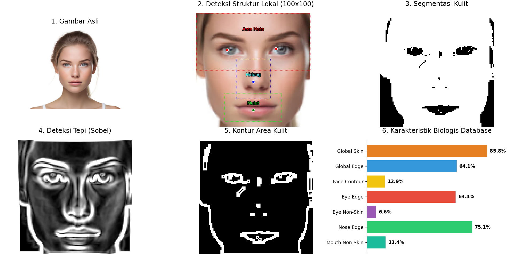

# SISTEM PENDETEKSI DAN PENCOCOKAN WAJAH 


Oleh: 
- Muhammad Fariq Faqih (24051204084)

---
Sebuah proyek eksperimental Face Detection dan Face Recognition yang dibangun **secara murni (from-scratch)** menggunakan teknik pengolahan citra digital (Digital Image Processing / DIP). 

Proyek ini **TIDAK MENGGUNAKAN** model Machine Learning / Deep Learning instan (seperti YOLO, Dlib, atau FaceNet) untuk melakukan ekstraksi wajah. Semua fitur biologis dan struktur wajah dianalisis menggunakan manipulasi matriks gambar dasar.

---

## Fitur Utama

### 1. Custom Haar Cascade Inference Engine
Mendeteksi lokasi wajah dan mata menggunakan perhitungan *Integral Image* manual yang mengevaluasi nilai _Haar-like features_ secara *sliding-window*, tanpa bergantung pada eksekutor *built-in* library.

### 2. Ekstraksi Fitur Biologis & Geometris
Mengekstrak data biologis secara langsung dari piksel tanpa Neural Network:
- **Jarak & Rasio Geometris**: Proporsi jarak antar mata, jarak hidung ke mata, dan rasio posisi bibir.
- **Asimetri Wajah (Symmetry Error)**: Mengkalkulasi nilai asimetris wajah dengan membandingkan (*folding*) intensitas sisi kiri dan kanan wajah.
- **Skin & Edge Segmentation**: Segmentasi area kulit melalui ruang warna HSV dan ekstraksi kontur menggunakan *Sobel Edge Detection*.
- **Area Lokalisasi**: Evaluasi statistik kepadatan struktur pada masing-masing region (Top/Mata, Middle/Hidung, Bottom/Mulut).

### 3. Analisis Grid Lokal & Tekstur
Untuk memastikan keunikan setiap individu, sistem melakukan analisa tekstur lokal:
- **Local Binary Pattern (LBP) Histogram**: Membaca pori-pori dan tekstur halus wajah menggunakan komputasi matriks *bitwise*.
- **Grid 4x4 Features**: Memecah wajah ke dalam 16 area kecil untuk diukur intensitas cahaya, penyebaran area kulit, dan kerapatan garisnya.

### 4. Visualisasi Dashboard 6-Panel

Sistem dilengkapi modul visualizer berbasis Matplotlib yang memetakan kembali angka-angka di database ke dalam gambar asli secara akurat (dengan titik koordinat dan mask segmentasi asli).

---

## Struktur File
- `deteksi_wajah.py`: Memindai gambar `webcam/` menggunakan Haar Cascade dan melakukan _cropping_ otomatis terhadap wajah.
- `ekstraksi_fitur.py`: Menerima hasil *crop* dan merangkum seluruh fitur biologis di atas ke dalam basis data JSON.
- `visualisasi_fitur.py`: Melakukan render visual dari data profil pada JSON ke atas gambar wajah.
- `src/`: Berisi seluruh *core logic* mulai dari kalkulasi matriks fitur (`feature_extractor.py`), operasi gambar dasar (`image_utils.py`), hingga pembacaan integral Haar (`manual_cascade.py`).

## Cara Penggunaan
1. Masukkan gambar wajah ke dalam folder `webcam/`.
2. Jalankan deteksi dan crop:
   ```bash
   python deteksi_wajah.py
   ```
3. Lakukan analisis dan ekstraksi profil biologis:
   ```bash
   python ekstraksi_fitur.py
   ```
4. Lihat hasil pembongkaran data secara visual:
   ```bash
   python visualisasi_fitur.py
   ```
